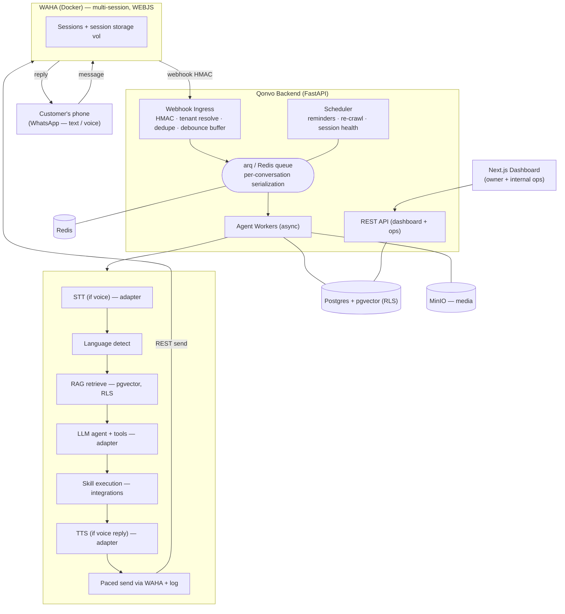

# Qonvo — Technical Design Document (v2)

> AI customer representative that lives on a business's WhatsApp number.
> Implementation reference for building the multi-tenant SaaS MVP.
> v2: revised after design review — adds concurrency/debounce semantics, auth model, session
> recovery, human-takeover state machine, ops console, billing/entitlements, and reliability ops.

---

## Context

Qonvo is an **AI customer representative on a business's WhatsApp number** — answering customers
24/7 from the business's own knowledge, by text and voice, and taking actions (bookings, leads,
sheet/CRM writes). The product spec (`Qonvo - AI Whatsapp Rep.md`) defines a **base offering**
(never miss a message + one core action) plus modular **VAS** (voice, multilingual, agentic
workflows, integrations, outbound, team inbox, analytics, white-label).

### Decisions locked

| Area | Decision |
|------|----------|
| **WhatsApp layer** | WAHA-only for MVP (self-hosted, unofficial WhatsApp Web). **Reactive loop: inbound → process → reply**. Bot-initiated messaging limited to **capped booking confirmations/reminders** (see §5.7). **No bulk/broadcast** — that's the ban-risk behavior. |
| **AI layer** | Provider-agnostic, config-driven. **LLM:** Gemini / OpenAI / OpenRouter / any OpenAI-compatible. **STT:** Groq or Gemini now, OpenAI Whisper later. **TTS:** OpenAI / Uplift AI (Urdu+regional) / Google. Swappable per need/efficiency. |
| **Stack** | Python (FastAPI) backend + Next.js dashboard + Postgres (with pgvector) + Redis. Queue: **arq** (async-native, fits FastAPI). |
| **Deployment** | Single VPS via Docker Compose, **built multi-tenant from day one**. |
| **Onboarding model** | **Admin-provisioned (fully managed)** — Qonvo staff create tenants via an internal ops console; owners receive an invited login. No self-serve signup in MVP. |
| **Billing** | **Manual invoicing for MVP.** Usage/tokens metered per tenant in DB; plan entitlements enforced via tenant config flags. Payment gateway later. |
| **Reminders** | **In scope, capped**: confirmations/reminders only to customers who booked via chat (existing conversation, opt-in), strict rate caps + jitter + business-hours sending. |
| **Notifications** | MVP: **WhatsApp alert to owner's own number** (via tenant's WAHA session) + **dashboard notification log**. Email (Resend/SMTP) in Phase 3 — needed for "your WhatsApp disconnected" alerts, which WhatsApp itself can't carry. |

---

## 1. What WAHA gives us (grounding facts)

- **REST + webhooks** wrapper over WhatsApp Web. Docker image (`devlikeapro/waha`).
- **Multiple sessions (numbers) per container** — key for multi-tenancy on one VPS.
- **Session lifecycle:** `STOPPED → STARTING → SCAN_QR_CODE → WORKING → FAILED`. Sessions persist
  across restarts if session storage is mounted.
- **Engines:** WEBJS/WPP (browser, most features incl. media) vs NOWEB/GOWS (websocket, lighter,
  higher scale). MVP: **WEBJS**; revisit NOWEB/GOWS for scale.
- **Licensing (verified 2026-07):** As of **v2026.6.1 WAHA is 100% free & open-source** — the free
  Core image includes **unlimited simultaneous sessions**, media (images/files/**voice/audio**),
  Postgres/Mongo/S3 storage, API-key auth + Swagger security. Core/Plus/PRO tiers dropped; the
  $5/mo "Community" tier is donation-only. **Latest release: `2026.6.2` (2026-06-27)** — pin it.
  Docker tags are engine-prefixed: `devlikeapro/waha:latest-2026.6.2` is the WEBJS build
  (`noweb-*` / `gows-*` for other engines).
  *Contingency:* single external dependency — re-verify licensing on upgrades; if the model ever
  reverts, the last free version remains usable (Apache-2.0) while we evaluate alternatives.
- **Webhook events:** `session.status`, `message`, `message.any`, `message.reaction`, `message.ack`,
  `message.edited`, `message.revoked`, `presence.update`, `call.*`, group/label events. Per-session
  or global webhooks; **HMAC-SHA512** signature (`X-Webhook-Hmac`).
- **Compliance reality:** unofficial client → **ban risk** on aggressive outbound. Mitigations in §5.6.

### Send / session API (verified from WAHA docs + [Swagger](https://waha.devlike.pro/swagger/))

All authed with `X-Api-Key`; JSON bodies keyed by `session` + `chatId` (`<number>@c.us` users, `@g.us` groups).

| Purpose | Endpoint | Key fields |
|---------|----------|-----------|
| Send text / reply | `POST /api/sendText` | `{session, chatId, text, reply_to?, linkPreview?}` |
| Send voice note | `POST /api/sendVoice` | `{session, chatId, file:{mimetype:"audio/ogg; codecs=opus", url\|data}, convert?}` — **OPUS-in-OGG required**; `convert:true` or `POST /api/{session}/media/convert/voice` |
| Send image/file | `POST /api/sendImage` · `POST /api/sendFile` | `{session, chatId, file:{mimetype,url,filename}, caption?}` |
| Mark seen | `POST /api/sendSeen` | `{session, chatId}` |
| Typing indicator | `POST /api/startTyping` · `POST /api/stopTyping` | `{session, chatId}` |
| Create session | `POST /api/sessions` | name + `webhooks[]` (url, events, HMAC key, retries) |
| Session status | `GET /api/sessions/{name}` | state (WORKING, etc.) |
| QR for onboarding | `GET /api/{session}/auth/qr` | QR expires ~20s/refresh — dashboard must poll & re-render (§10) |

Human-like loop: `sendSeen` → `startTyping` → (delay ∝ reply length) → send → `stopTyping`.

---

## 2. High-level architecture



**Docker Compose stack:** `waha`, `api`, `worker`, `scheduler`, `postgres`, `redis`, `minio`
(required — see §12.3), `dashboard`, `caddy` (TLS + reverse proxy). Optional: `uptime-kuma`/`grafana`.

---

## 3. Multi-tenancy model

- **Tenant = business.** Single Postgres, shared schema with `tenant_id` on every row.
- **Isolation = defense in depth, day one:**
  1. **Postgres RLS enabled from the start** — `FORCE ROW LEVEL SECURITY` + policies on all tenant
     tables keyed to `NULLIF(current_setting('app.tenant_id', true), '')::uuid`. One missing
     `WHERE` clause ≠ cross-tenant leak.
  2. **Three DB roles** (verified in Phase 0 — superusers/owners bypass RLS, so role separation is
     what makes RLS real):
     - `qonvo` (owner, superuser) — **Alembic migrations only** (`QONVO_MIGRATIONS_DATABASE_URL`).
     - `qonvo_app` (NOSUPERUSER, NOBYPASSRLS) — all request/worker code (`QONVO_DATABASE_URL`).
     - `qonvo_system` (BYPASSRLS, DML-only) — trusted cross-tenant paths only: webhook tenant
       resolution, scheduler fleet scans (`QONVO_SYSTEM_DATABASE_URL`). Native role attribute, not
       a GUC — policies deliberately have **no GUC escape hatch** (any session can set a GUC).
     Roles auto-created by `scripts/postgres-init/01-app-role.sh` on first init.
  3. App-layer scoping in the data-access layer as the second net.
  4. pgvector similarity queries always filtered by `tenant_id` *inside* the SQL (never post-filter).
- **Sessions ↔ tenants:** a `whatsapp_sessions` mapping table (`session_name`, `tenant_id`, `label`,
  `status`). **Not** `session_name = tenant_id` — a tenant can have multiple numbers/departments
  (VAS). Webhook ingress resolves tenant via this table on every event.
- **Per-tenant config:** persona/tone, languages, provider+model choices, business hours, escalation
  rules, enabled skills, **plan entitlements** (§13), integration credentials (encrypted).
- **Secrets at rest:** per-tenant integration tokens encrypted with a master key (Fernet/AES-GCM).
  MVP: master key in the VPS env file, outside the repo, backed up separately (documented
  limitation); revisit KMS/SOPS at scale.

---

## 4. Provider-abstraction layer

One internal interface per capability; adapters behind it; selected per-tenant via config, falling
back to system default. Keys in central secrets + optional per-tenant override.

- **`LLMProvider`** — `generate(messages, tools, model) → text + tool_calls`. Adapters: OpenAI,
  Gemini, OpenRouter, generic OpenAI-compatible (`base_url` + key). **Must support image inputs**
  (vision) — customers send photos (documents, products); pick vision-capable default models.
- **`STTProvider`** — `transcribe(audio) → text + lang`. Adapters: Groq (Whisper), Gemini, OpenAI.
- **`TTSProvider`** — `synthesize(text, voice, lang) → audio`. Adapters: OpenAI, Uplift AI
  (Urdu/regional), Google. Language→provider routing map (e.g. `ur → uplift`).
- **`EmbeddingProvider`** — OpenAI/Gemini/local.

---

## 5. Message-processing pipeline (the reply loop)

### 5.1 Ingress & filtering
- Verify HMAC → resolve tenant via `whatsapp_sessions` → **filter**:
  - Process **only `@c.us`** (1:1). Ignore `@g.us` (groups), `status@broadcast`, newsletters.
  - Subscribe to **`message`** (not `message.any`) so our own sends don't loop back. Additionally
    subscribe `message.any` *only* to detect **owner `fromMe` replies** as a takeover signal (§5.5)
    — never process `fromMe` through the agent pipeline.
  - `call.received` → reject + optional auto-message ("we're on chat — text us here").
- **Dedupe:** Redis `SETNX waha:msg:{message_id}` with 24h TTL, backed by a **unique constraint on
  `messages.wa_message_id`** (survives Redis restarts).
- Ack the webhook with `200` immediately after buffering (WAHA retries on failure — configure
  webhook `retries` on session create).

### 5.2 Debounce / burst aggregation  *(critical — users send fragments)*
- Inbound messages are **buffered per `(session, chatId)`** in a Redis list with a **sliding 5s
  window** (configurable per tenant, 3–10s): each new fragment resets the timer.
- When the window closes, one job is enqueued with **all buffered fragments coalesced** into a
  single LLM turn (fragments joined in arrival order; voice fragments transcribed first).
- **Late-arrival rule:** if a fragment arrives while a job for that conversation is *processing*,
  it starts a new buffer; the next job's context includes the reply we already sent, so the agent
  handles it coherently. No mid-flight cancellation in MVP.

### 5.3 Per-conversation serialization & delivery guarantees
- **One conversation = one job at a time.** Redis lock per `conversation_id`
  (`SET NX PX`); a worker that can't acquire re-enqueues with delay. Guarantees ordered replies and
  prevents doubled tool calls.
- **Queue: arq** with at-least-once semantics — retries with exponential backoff (3 attempts),
  then **dead-letter queue** (a `failed_jobs` table + ops alert). Because delivery is
  at-least-once, **every write-skill takes an idempotency key** (§7).
- **Staleness guard (reconnect backlog):** when a session reconnects after downtime, WhatsApp
  dumps queued messages. Messages older than a threshold (default 2h, configurable) are **logged
  but not auto-replied**; instead the agent sends one summary-style catch-up reply per conversation
  ("sorry for the delay — how can I help?") rather than answering hours-old fragments one by one.

### 5.4 Agent processing (inside the worker)
1. Voice fragments → download media → **STT** → transcript (+ detected language).
2. Images → passed to the vision-capable LLM as image inputs.
3. **Language detection:** LLM-internal (the agent is instructed to reply in the customer's
   language; short messages defeat statistical detectors). Tenant's primary language is the default
   when ambiguous.
4. **Business-rules gate:** business hours (→ custom auto-reply), spam filter,
   paused/human-takeover check (§5.5), plan/quota check (§13).
5. **RAG retrieve:** embed coalesced query → pgvector top-k (tenant-scoped SQL).
6. **Agent step:** LLM with system prompt (persona + grounding + "offer to connect a human when
   unsure") + **windowed history** + retrieved chunks + tool schemas for enabled skills.
   - **History window:** last 20 messages *or* ~4k tokens, whichever is smaller, plus a **rolling
     conversation summary** stored on the conversation row and refreshed every N turns.
   - **Conversation boundary:** a conversation is "active" until 24h of inactivity (configurable);
     after that a new conversation row starts (summary carried over as context).
7. **Tool loop:** execute skill calls, feed results back, until final answer (max 5 iterations).
8. **Reply rendering:** text always; voice note when inbound was voice or tenant prefers voice
   (→ TTS → OPUS/OGG). Human-like: `sendSeen` → `startTyping` → delay ∝ length → send.
9. **Log everything:** inbound, transcript, retrieved chunk IDs, tool calls + results, reply,
   token counts + computed cost (per provider pricing table).

### 5.5 Human takeover & pause state machine
States per conversation: `bot_active` → `paused_by_agent` | `paused_by_owner` | `needs_human`.
- **Triggers to pause:** (a) explicit customer request / low confidence / escalation rule →
  `needs_human` + notify owner; (b) owner replies **from their own phone** (detected via
  `message.any` + `fromMe=true` on that chat) → **implicit takeover**, auto-pause; (c) owner clicks
  take-over in dashboard inbox → `paused_by_owner`.
- **While paused:** inbound is logged + visible in inbox; **no bot replies**; owner replies from
  the dashboard are sent through WAHA (`sendText` from the tenant session) and logged as
  `direction=outbound, author=human`.
- **Resume:** manual (dashboard button) or **auto-resume TTL** (default 6h after last human
  message, configurable). On resume, the bot's next context includes the human-written exchange.
- **Escalation notification (MVP):** WhatsApp message from the tenant's session to the **owner's
  personal number** (stored in tenant config) + dashboard notification log (`notifications` table).
  Email transport added Phase 3 (required for disconnect alerts, §12.1).

### 5.6 Send pacing / ban avoidance (concrete, not aspirational)
- **Per-session token-bucket rate limiter** in Redis: default 1 msg / 3–8s (jittered), burst 3;
  daily send cap per session (default 500, configurable).
- Typing indicators + length-proportional delays on every send (also throttles throughput).
- **New-number warm-up schedule:** week 1 cap 50/day, week 2 150/day, then normal — enforced by
  the same limiter with a per-session schedule.
- All sends (bot, human-via-dashboard, reminders) go through one **send gateway** module that
  enforces pacing, ordering, and logging — no direct WAHA calls from feature code.

### 5.7 Scheduled reminders (capped outbound — the only bot-initiated messaging)
- Only for customers with an **existing conversation** who booked via chat; opt-out honored
  ("stop" → suppression list).
- Sent by the `scheduler` service through the send gateway: business-hours only, jittered,
  counted against the daily cap, max 2 reminders per booking (confirmation + 24h-before).
- Broadcasts/campaigns remain **out of scope** until an official Cloud API provider is added.

---

## 6. Knowledge base / RAG (per-tenant "brain")

- **Ingestion:** manual editor, file upload (PDF/DOCX/CSV), website crawl. Chunk → embed → pgvector
  with `tenant_id` + source metadata.
- **Website refresh:** scheduler re-crawls sources with `auto_refresh=true` on a per-source cron
  (default weekly); changed pages re-chunked/re-embedded, stale chunks tombstoned.
- **Grounding:** system prompt forbids fabrication; on gaps → offer human handoff.
- **Knowledge-gap capture:** unanswered/handed-off questions logged → dashboard "top questions the
  bot couldn't answer."

---

## 7. Agentic skills / tools

- **Skill = tool** (JSON schema + async handler) in a registry; per-tenant enable/disable + config,
  gated by **plan entitlements** (§13).
- **Write-skills are idempotent:** every mutating call carries an idempotency key
  (`{conversation_id}:{tool_call_id}`); handlers check a `skill_executions` table before executing
  (protects against at-least-once redelivery).
- **MVP built-ins:** `capture_lead`, `append_to_google_sheet`, `book_appointment` (Google Calendar,
  incl. confirmation + reminder scheduling per §5.7), `human_handoff`.
- **VAS skills (phased):** order-taking/cart, lead qualification+scoring, CRM sync (HubSpot/Zoho),
  lookups (order/booking status), **payment links/status surfacing** (no card data), multi-step
  chained flows, notifications (Slack/email).
- **Credential vault:** per-tenant OAuth/token store, encrypted (§3).

---

## 8. Auth & access control

- **Model:** admin-provisioned. Qonvo staff create tenants + invite owners (email invite link →
  set password). **No self-serve signup** in MVP.
- **Stack:** Auth.js (NextAuth) on the dashboard with credentials + email magic-link; short-lived
  **JWT** (tenant_id + role claims) consumed by FastAPI middleware, refresh via session cookie.
- **Roles:**
  - `owner` — full tenant control.
  - `staff` — inbox + knowledge editing, no settings/billing (team-seats VAS).
  - `qonvo_admin` — internal superadmin (separate flag, not a tenant role); can impersonate a
    tenant (audited) for support.
- **Every API route tenant-scoped:** middleware sets `app.tenant_id` for RLS from the JWT; ops
  routes require `qonvo_admin` and log to an audit table.

---

## 9. Internal ops console  *(the "fully managed" tooling)*

Same Next.js app, `/admin` area, `qonvo_admin` only:
- **Tenant lifecycle:** create tenant, configure persona/providers/skills, invite owner, suspend.
- **Onboarding execution:** run knowledge ingestion, connect integrations, start WAHA session +
  QR flow on the tenant's behalf, run test conversations against a **sandbox conversation mode**
  (agent pipeline with a fake chat, no WAHA) before go-live.
- **Fleet health:** all sessions + statuses, restart/re-QR, webhook failure counts, DLQ browser.
- **Usage & billing view:** per-tenant tokens/cost/message counts → manual invoicing (§13).
- **Impersonation** (audited) for support.

---

## 10. Owner dashboard (Next.js)

- **Onboarding wizard** (also usable by ops on behalf of tenant): connect number — show WAHA QR,
  **auto-refresh the QR every ~15s** (it expires ~20s; poll `GET /api/{session}/auth/qr` +
  `session.status` until `WORKING`), set persona/language, ingest knowledge, pick core action, test.
- **Knowledge manager:** CRUD, upload docs, website ingest + refresh schedule, gap review.
- **Inbox:** live transcripts, media/voice playback, **take-over / release** (drives §5.5 state
  machine), reply-as-business, pause/resume bot per conversation or globally.
- **Notifications:** persistent log (escalations, disconnects, quota warnings).
- **Settings:** persona/tone, languages, hours, escalation rules + owner alert number, provider
  selection, skill toggles + integration connect.
- **Analytics:** volume, response time, resolution/handoff rate, leads/bookings, language & peak
  hours, top unanswered questions.
- **Brand:** follows `Branding+Marketing/Qonvo Brand Kit.pdf` — green palette (spring green primary,
  lime accent, near-black dark-green, off-white paper), dark+light modes, bold display type, pill
  buttons, punchy copy ("Never miss a customer"). Build a **design-token file** from the kit.

---

## 11. Data model (all tenant-scoped, RLS-enabled)

- `tenants`, `users`, `tenant_users` (role: owner/staff), `audit_log`
- `tenant_config` (persona, languages, providers, hours, rules, owner_alert_number, entitlements)
- `whatsapp_sessions` (session_name, tenant_id, label, status, engine, daily_cap, warmup_stage)
- `knowledge_sources` (type, url, auto_refresh, cron), `knowledge_chunks` (pgvector, tombstone)
- `conversations` (state: bot_active/paused_*/needs_human, summary, last_activity_at)
- `messages` (direction, author bot/human/customer, type, transcript, media_key, lang,
  tokens, cost, **unique wa_message_id**)
- `skills`, `skill_executions` (idempotency), `integrations` (encrypted creds)
- `leads`, `bookings` (+ reminder schedule), `reminder_suppressions` (opt-outs)
- `handoffs`, `notifications`, `analytics_events`, `usage_counters` (per tenant per day)
- `failed_jobs` (DLQ)

---

## 12. Reliability & operations

### 12.1 Session health & recovery
- Scheduler watches `session.status` events + polls session state every 60s.
- On `FAILED`/logout: auto-restart attempt; if still down → notify owner (**email once available;
  MVP: dashboard notification + ops alert** — WhatsApp can't carry its own down-alert) + flag in
  ops console for a re-QR flow.
- Phone-offline >14 days unlinks WhatsApp Web — surfaced as a session-health warning trend.
- Reconnect backlog handled by the staleness guard (§5.3).

### 12.2 Backups / DR (single-VPS SPOF acknowledged)
- **Nightly `pg_dump`** + **WAHA session-volume snapshot** + MinIO bucket sync → offsite object
  storage (S3/B2), 14-day retention. Master encryption key backed up separately (manual, sealed).
- Documented **restore runbook**; quarterly restore test. Losing the session volume = every tenant
  re-scans QR — that's the acceptable worst case for MVP.

### 12.3 Media handling
- **Download media immediately on webhook receipt** (WAHA media URLs are not durable) → store in
  MinIO keyed `tenant/{id}/conversations/{id}/...`; DB stores the object key.
- Retention: 90 days for media, configurable per tenant; conversations/transcripts kept (see 12.5).
- MinIO is **required**, not optional — voice notes and TTS replies flow through it.

### 12.4 Observability
- Structured JSON logs (loguru) shipped to files + rotated; per-tenant/session/conversation IDs on
  every line.
- `/healthz` on api/worker/scheduler; **Uptime Kuma** for uptime + alerting; **Sentry** for
  exceptions; lightweight metrics (message throughput, queue depth, reply latency, provider errors,
  per-session send counts) exposed for Grafana later.

### 12.5 Data retention / privacy
- Conversation transcripts kept 12 months (configurable per tenant), media 90 days.
- Per-tenant data export + delete-on-termination path (also covers GDPR-style requests).
- Customers' phone numbers are PII: never logged to third-party services; provider calls send
  message content only.

### 12.6 Testing / staging
- **Sandbox conversation mode:** full agent pipeline against a fake chat (no WAHA) — used in CI,
  ops onboarding tests, and prompt tuning.
- One **staging tenant + dedicated test number** on the production WAHA container for end-to-end
  smoke tests (there is no official WhatsApp sandbox for unofficial clients).
- Unit/integration tests: HMAC verify, tenant resolution, RLS scoping, debounce windowing,
  conversation locking, idempotent skills, provider adapters (mocked).

---

## 13. Billing, metering & entitlements (MVP = manual invoicing)

- **Metering:** every message logs tokens + computed provider cost; rolled up into
  `usage_counters` (tenant × day: messages in/out, voice minutes, tokens, cost).
- **Entitlements:** `tenant_config.entitlements` flags (voice, languages count, skills allowed,
  monthly message quota, seats). Skill registry + pipeline check them; **soft limit** at 80%
  (owner notification) and **hard limit** behavior configurable (degrade to handoff-only replies —
  never silent death).
- **Invoicing:** ops console usage view → manual invoice (bank transfer / local rails). Payment
  gateway (Stripe or PK-friendly alternative) is Phase 4.

---

## 14. Repo layout

```
qonvo/
├─ docker-compose.yml          # waha, api, worker, scheduler, postgres, redis, minio, dashboard, caddy
├─ .env.example
├─ backend/
│  ├─ app/
│  │  ├─ api/                  # REST routes (owner + /admin ops) + webhook ingress
│  │  ├─ core/                 # config, security (HMAC, JWT, encryption), tenancy/RLS
│  │  ├─ providers/            # llm/ stt/ tts/ embedding adapters
│  │  ├─ agent/                # debounce, pipeline, RAG, tool loop, prompts, history windowing
│  │  ├─ skills/               # registry + idempotent handlers + integrations
│  │  ├─ waha/                 # WAHA client + send gateway (pacing) + session health
│  │  ├─ models/ + db/         # SQLAlchemy, Alembic, RLS policies
│  │  └─ workers/              # arq workers + scheduler jobs (reminders, re-crawl, health)
│  └─ tests/
├─ dashboard/                  # Next.js (owner app + /admin ops console), Auth.js
└─ docs/DESIGN.md
```

---

## 15. Phasing / roadmap

- **Phase 0 — Foundation:** Compose stack, tenant model + RLS, Auth.js + JWT + roles, WAHA client +
  send gateway, webhook ingress (HMAC, filtering, dedupe, debounce), arq + conversation locking,
  session QR onboarding, session-health monitor, backups.
- **Phase 1 — Base offering:** RAG ingestion + grounded text replies, history windowing, persona/
  language config, business-hours/escalation rules, pause/takeover state machine, owner inbox +
  knowledge manager, ops console (tenant lifecycle + fleet health), lead capture + one core action,
  WhatsApp owner-alerts, usage metering. = **"never miss a customer."**
- **Phase 2 — Voice VAS:** STT/TTS adapters, voice-in/voice-out (OPUS/OGG), multilingual incl.
  Urdu (Uplift AI), vision inputs.
- **Phase 3 — Agentic VAS:** skill expansion (orders, CRM, lookups, payment links), chained flows,
  booking reminders (capped outbound), email notifications, analytics dashboard, Sentry/metrics
  maturity.
- **Phase 4 — Scale/enterprise:** team seats/shared inbox, white-label, payment gateway billing,
  official Cloud API provider for compliant broadcast, NOWEB/GOWS evaluation, dedicated infra.

---

## 16. Open items / accepted risks

- **Number provisioning:** MVP supports **existing business numbers only**. "We provision a number"
  = ops process (SIM + device kept online) — deliberately out of MVP build scope; revisit with
  hosted-device or Cloud API options.
- **WAHA ban risk:** mitigated per §5.6/§5.7 but never zero on an unofficial client; positioning +
  onboarding sets expectations, and the provider abstraction keeps a Cloud API exit path.
- **Single-VPS SPOF:** accepted for MVP with §12.2 backups; scale-out plan is Compose → per-service
  hosts (WAHA pinned to persistent storage) without code change.
- **Master key on VPS env:** accepted for MVP; documented; KMS later.

---

## 17. Verification (prove it works)

- **Text loop:** QR-onboard a session → burst 3 fragments at it → exactly **one** coherent grounded
  reply (debounce), webhook HMAC verified.
- **Voice loop:** voice note in → transcript logged → same-language voice note reply (OPUS/OGG).
- **Concurrency:** two rapid parallel conversations + a booking each → no interleaved replies, no
  duplicate calendar events (idempotency).
- **Takeover:** owner replies from phone → bot silences; auto-resume after TTL; dashboard reply
  sends through the business number.
- **Session drop:** stop the phone's link → owner + ops notified; reconnect → stale backlog handled
  with catch-up reply, not fragment-by-fragment answers.
- **Isolation:** two tenants; verify RLS blocks cross-tenant reads even with app-layer scoping
  removed in a test.
- **Provider swap:** change LLM/STT/TTS in tenant config → next reply uses the new provider.
- **Quota:** exceed a hard message quota → graceful handoff-only mode + owner notification.
- Automated: HMAC, tenant resolution, RLS, debounce, locking, idempotent skills, adapters.

---

## References

- WAHA — https://waha.devlike.pro/ · Swagger — https://waha.devlike.pro/swagger/ ·
  GitHub — https://github.com/devlikeapro/waha · Pricing (free since 2026.6.1) — https://waha.devlike.pro/pricing/
- Product spec — `Qonvo - AI Whatsapp Rep.md` · Brand kit — `Branding+Marketing/Qonvo Brand Kit.pdf`
